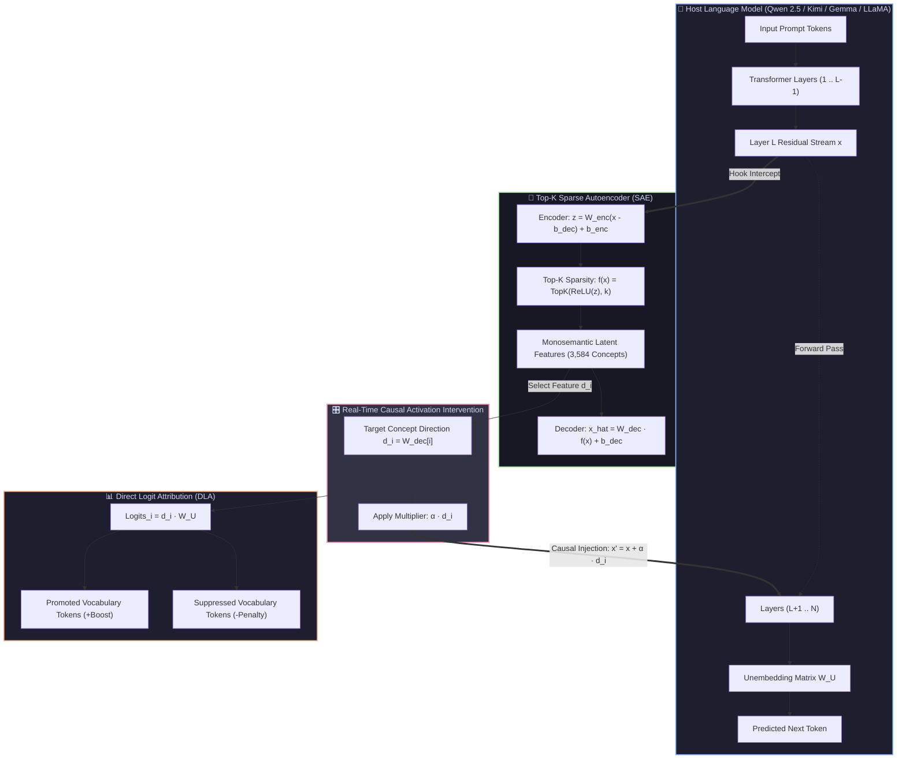

# 🧠 Interp Circuit Engine (`interp-circuit-engine`)

[](https://www.python.org/downloads/)
[](https://pytorch.org/)
[](https://opensource.org/licenses/MIT)
[](tests/)

**An End-to-End Research & Systems Suite for Mechanistic Interpretability, Sparse Autoencoders (SAEs), and Causal Concept Steering on Frontier & Open-Weights LLMs in PyTorch.**

Supports cutting-edge architectures including **`moonshotai/Kimi-k2.6`**, **`Qwen/Qwen2.5`**, **`google/gemma-2`**, **`meta-llama/Llama-3`**, **`HuggingFaceTB/SmolLM2`**, and custom HuggingFace model IDs.

---

## 🎨 Visual System Architecture

### 1. End-to-End Concept Extraction & Causal Steering Loop



---

### 2. How Sparse Autoencoders Decompose the "Black Box"

```
┌──────────────────────────────────────────────────────────────────────────────┐
│                    POLYSEMANTIC RESIDUAL STREAM (896 Dims)                   │
│         [ Single neuron fires for: Eiffel Tower + DNA + French + Code ]       │
└──────────────────────────────────────┬───────────────────────────────────────┘
                                       │
                         [ Top-K Sparse Autoencoder ]
                                       │
                                       ▼
┌──────────────────────────────────────────────────────────────────────────────┐
│                MONOSEMANTIC CONCEPT DICTIONARY (3,584 Features)              │
│                                                                              │
│  🟢 Feature #42:   "Formal Politics & Government"   ──► [minister, parliament]│
│  ⚪ Feature #43:   (Inactive, 0.0)                                           │
│  🟢 Feature #108:  "Quantum Entanglement Math"      ──► [superposition, spin]│
│  ⚪ Feature #109:  (Inactive, 0.0)                                           │
│  🟢 Feature #512:  "Positive Tone & Optimism"       ──► [breakthrough, hope] │
│  ... (Only k=32 active features per token, 3552 features turned off to 0)    │
└──────────────────────────────────────┬───────────────────────────────────────┘
                                       │
                         [ Causal Activation Hook ]
                                       │
                                       ▼
┌──────────────────────────────────────────────────────────────────────────────┐
│                 LIVE STEERED AUTOREGRESSIVE GENERATION                       │
│                                                                              │
│  🔴 Baseline Output (α = 0.0):                                               │
│     "The committee met yesterday to review the proposed schedule..."         │
│                                                                              │
│  🟢 Steered with Feature #108 (Quantum Physics, α = +8.0):                   │
│     "The quantum state vector evolved under the Hamiltonian operator..."     │
└──────────────────────────────────────────────────────────────────────────────┘
```

---

## 🌟 Key Capabilities

* **🤖 Frontier & Modern Architecture Support:**
  * **Kimi K2.6 / Moonlight (`moonshotai`)**: Native layer resolution and hook extraction for Moonshot AI architectures.
  * **Qwen 2.5 (`Qwen/Qwen2.5-0.5B`, `1.5B`, `7B`)**: SOTA compact reasoning models with Grouped-Query Attention (GQA), RoPE, and SwiGLU.
  * **SmolLM2 & Gemma 2**: Ultra-fast compact models for on-device and high-throughput research.
* **🔬 State-of-the-Art SAE Architectures:**
  * **Top-K SAE** (*Gao et al., OpenAI / Anthropic 2024*): Eliminates $L_1$ shrinkage bias with exact $k$-sparsity per token and dead-latent auxiliary losses.
  * **Gated SAE** (*Rajamanoharan et al., Google DeepMind 2024*): Decouples feature gating from magnitude estimation.
  * **JumpReLU SAE**: Threshold-based activation with straight-through estimator (STE).
  * **Standard $L_1$ SAE**: Classical baseline with unit-norm constrained decoders ($\|W_{\text{dec}}[:, i]\|_2 = 1$).
* **⚡ High-Throughput Streaming Extraction Buffer:**
  * PyTorch forward hooks for transformer residual streams (`resid_post`, `mlp_out`, `attn_out`).
  * In-memory token-shuffling ring buffer to break sequential intra-document auto-correlations.
  * Native Apple Silicon (MPS), CUDA, and CPU acceleration.
* **🛡️ Active Dead Latent Tracker & Resampler:**
  * Detects inactive neurons and resamples weights to align with high-error residual vectors ($\mathbf{x} - \mathbf{\hat{x}}$).
* **📊 Direct Logit Attribution (DLA) & Auto-Labeling:**
  * Projects decoder feature directions $\mathbf{d}_i$ onto the unembedding matrix $W_U$ to identify tokens promoted or suppressed.
* **🎯 Causal Activation Steering Engine:**
  * Real-time autoregressive text generation intervention: $\mathbf{x}_{\text{steered}} = \mathbf{x} + \alpha \cdot \mathbf{d}_i$.
  * Supports addition, clamping, ablation (subspace removal), and multi-concept combinations.
* **🖥️ Interactive Streamlit Web UI:**
  * Visual dictionary browser, live token attribution charts, and side-by-side prompt generation with dynamic steering sliders.

---

## 🏛️ Supported Models Matrix

| Model Family | Model ID | Key Architecture Features |
| :--- | :--- | :--- |
| **Kimi / Moonshot** | `moonshotai/Kimi-k2.6` | MoE / Dense reasoning architecture |
| **Moonlight** | `moonshotai/Moonlight-16B-A3B` | Sparse Mixture-of-Experts (MoE) |
| **Qwen 2.5** | `Qwen/Qwen2.5-0.5B`, `1.5B` | GQA, RoPE, SwiGLU, RMSNorm |
| **SmolLM2** | `HuggingFaceTB/SmolLM2-360M` | Ultra-fast compact research baseline |
| **Gemma 2** | `google/gemma-2-2b` | Sliding window attention, Logit soft-capping |
| **GPT-2** | `gpt2` | Classical interpretability benchmark |
| **Custom Models** | Any HuggingFace CausalLM | Generic `model.layers` hook support |


---

## 🚀 Quickstart

### 1. Launch the Interactive Web Dashboard

```bash
streamlit run src/dashboard/app.py
```
Open **`http://localhost:8501`** in your browser! Switch between **Kimi K2.6**, **Qwen 2.5**, and other models directly from the sidebar.

### 2. Train on Modern LLMs

```bash
# Train Top-K SAE on Qwen 2.5 Layer 12
python -m src.cli train --config configs/qwen2.5_0.5b_layer12.yaml --steps 1000

# Train Top-K SAE on Kimi K2.6 Layer 12
python -m src.cli train --config configs/kimi_k2.6_layer12.yaml --steps 1000
```

### 3. Inspect Feature Semantics (Direct Logit Attribution)

```bash
python -m src.cli analyze \
  --checkpoint checkpoints/qwen2.5_layer12_topk/sae_final.pt \
  --model Qwen/Qwen2.5-0.5B \
  --feature 42 \
  --top-k 8
```

### 4. Run Causal Concept Steering in Terminal

```bash
python -m src.cli steer \
  --checkpoint checkpoints/qwen2.5_layer12_topk/sae_final.pt \
  --model Qwen/Qwen2.5-0.5B \
  --layer 12 \
  --feature 42 \
  --alpha 8.0 \
  --prompt "The key breakthrough in artificial intelligence came when" \
  --tokens 40
```

---

## 🧪 Testing

Run the complete test suite:

```bash
pytest tests/ -v
```

---

## 📜 License

MIT License. Free for academic, research, and commercial use.
